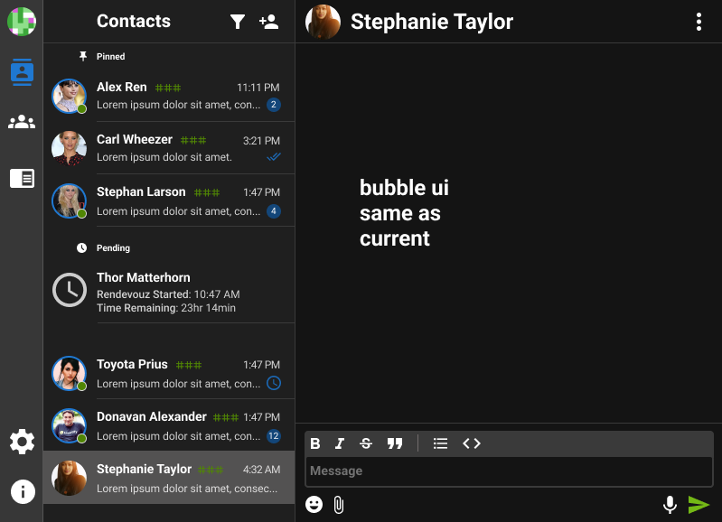
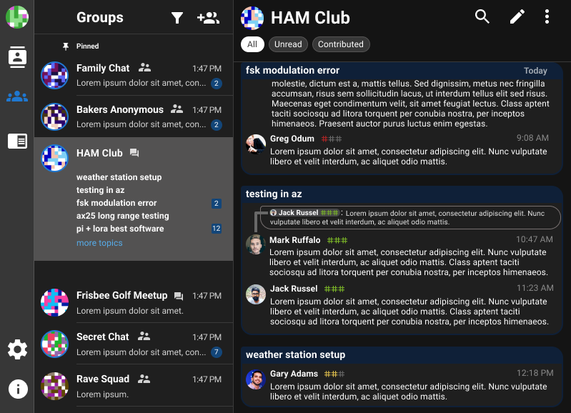
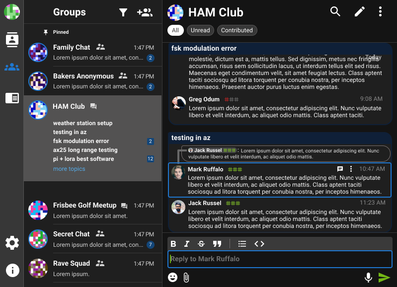
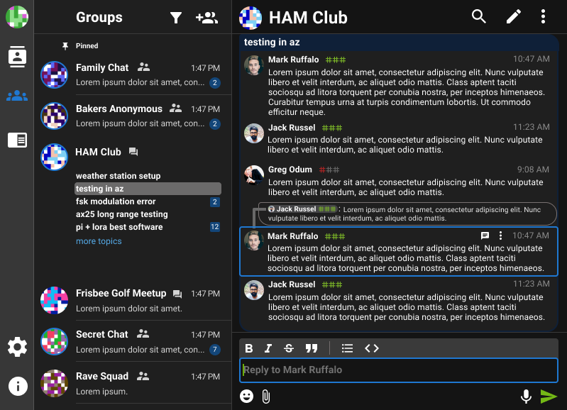
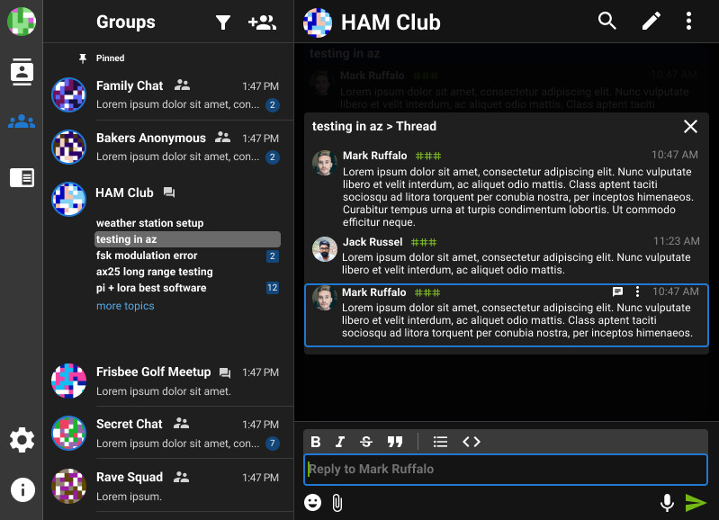
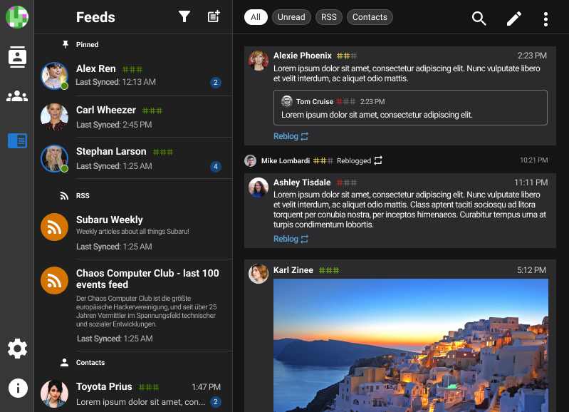

### Contact Screen (cc: https://code.briarproject.org/briar/briar-desktop/-/issues/262)

### Group Screen, with Group Selected in "All Messages" mode:

When you left-click on a message, the UI selects that message, and focuses your cursor in the response input, for a quick reply.

Right-clicking on a message selects that message, and expands the view to show the message in it's context within the "subject view" (à la zulip "topics")

Clicking on a "quoted reply preview" selects the reply message, and shows that specific thread in a pop-up. This thread represents the recursive parents of each message, up to the subject root message. 

In summary, messages in this group chat structure can either be:
- Root message in a new Subject
- Reply to exisiting message

This is fairly restrictive, and mirrors how email works. This will likely create a UI/UX hurdle for users expecting a more tradition group-chat UI. That being said, I believe this group chat structure significantly improves the utility of delay-tolerant async collaboration. In the Zulip community, many agree that there is a UI hurdle, but that this hurdle is well worth the effort for the added utility.

### Feeds

